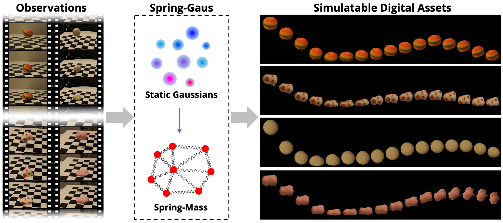

<p align="center">
  <h1 align="center">Reconstruction and Simulation of Elastic Objects with Spring-Mass 3D Gaussians</h1>
  <p align="center">
    <a><strong>Licheng Zhong</strong></a>
    ·
    <a><strong>Hong-Xing "Koven" Yu</strong></a>
    ·
    <a><strong>Jiajun Wu</strong></a>
    ·
    <a><strong>Yunzhu Li</strong></a>
  </p>
  <h2 align="center">ECCV 2024</h2>
</p>

<h3 align="center">
  <a href="https://colmar-zlicheng.github.io/spring_gaus"><strong>Project Page</strong></a>
  |
  <a href="https://arxiv.org/abs/2403.09434"><strong>arXiv</strong></a>
  |
  <a href="https://drive.google.com/drive/folders/1SN4vrPZSuBnbkDTLl0nu9g-boVUr5yO1?usp=sharing"><strong>Data</strong></a>
</h3>

<div align="center">
  
</div>

https://github.com/Colmar-zlicheng/Spring-Gaus/assets/111580763/eabaaa5f-b6ae-40ea-8e2e-03461c03e28c

## :rocket: Dependencies
```shell
git clone https://github.com/Colmar-zlicheng/Spring-Gaus.git --recursive
cd Spring-Gaus

# create conda environment
conda create -n Spring_Gaus python=3.7
conda activate Spring_Gaus
conda install pytorch torchvision torchaudio pytorch-cuda=11.6 cudatoolkit=11.6 -c pytorch -c nvidia
pip install -r requirements.txt

# install submodules for 3D Gaussian Splatting
pip install submodules/diff-gaussian-rasterization
pip install submodules/simple-knn

# install pytorch3d (https://pytorch3d.org/)
pip install "git+https://github.com/facebookresearch/pytorch3d.git"
```

## :cd: Datasets
Our synthetic data and real world data are provided at [Google Drive](https://drive.google.com/drive/folders/1SN4vrPZSuBnbkDTLl0nu9g-boVUr5yO1?usp=sharing). Download and extract the data to the `data` folder. If you don't have one, make it `mkdir data`.
```
├── data
│   ├── mpm_synthetic
│   │   ├── ... 
│   ├── real_capture
│   │   ├── ... 
```

## :steam_locomotive: Train
### General command

```shell 
python train.py -g 0 --cfg ${CONFIG_FILE} --eval_cam ${EVAL_CAM_ID} --exp_id ${EXP_ID}
```

### Command line arguments
- `-g, --gpu_id`, visible GPUs for training, e.g. `-g 0`. Only supports single GPU.
- `-c, --cfg`, e.g. `--cfg ${CONFIG_FILE}`. Config file path.

Optional:
- `--eval_cam`, e.g. `--eval_cam 0`. Camera id used in evaluation. If not provided, will use a random id.
- `--exp_id` specify the name of experiment, e.g. `--exp_id ${EXP_ID}`. It defaults to `'default'`. All results will be saved in `exp/${EXP_ID}_{timestamp}`.

### For example
```shell
# mpm_synthetic: torus
python train.py -g 0 --cfg config/mpm_synthetic/torus.yaml --eval_cam 5 --exp_id torus
# real_capture:  burger
python train.py -g 0 --cfg config/real_capture/burger.yaml --eval_cam 0 --exp_id burger
```

### Checkpoint
All the training checkpoints are saved at `exp/${EXP_ID}_{timestamp}/checkpoints/`


## :test_tube: Test
- set ${PATH_TO_CHECKPOINT} as the path to the checkpoint (Spring_Mass.pth.tar) to be loaded
```shell 
python test.py -g 0 --cfg ${CONFIG_FILE} --exp_id ${EXP_ID} --dy_reload ${PATH_TO_CHECKPOINT}
```

## :key: License

The code and model provided herein are available for usage as specified in the [LICENSE](LICENSE) file. By downloading and using the code you agree to the terms in the [LICENSE](LICENSE).


## :earth_asia: Citation

```bibtex
@article{zhong2024springgaus,
    title     = {Reconstruction and Simulation of Elastic Objects with Spring-Mass 3D Gaussians},
    author    = {Zhong, Licheng and Yu, Hong-Xing and Wu, Jiajun and Li, Yunzhu},
    journal   = {European Conference on Computer Vision (ECCV)},
    year      = {2024}
}
```

For more questions, please contact Licheng Zhong: zlicheng@sjtu.edu.cn
